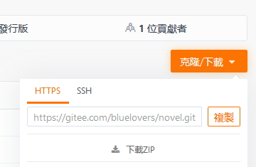

# 如何用码云(gitee.com)

首先先弄個 碼雲 帳號

https://gitee.com

## 介面說明

### 1

* Watch = 關注
* Star = 收藏
* [Fork](Pull%20Request.md) = 複製一份到你的空間內
* 

### 2

* 程式碼 = 檔案列表
* Issues = 留言/問題回饋
* [Pull Requests](Pull%20Request.md) = 申請合併的紀錄(包含 尚未接受 / 已合併 / 已取消)
* Wiki = 說明(如果有的話)

### 如何下載項目

點下載 ZIP 就可以下載壓縮檔

### 其他

* 另外不只文本 連 壓縮檔 圖片...等等都能夠存

### 進階功能

* [如何安裝 Git](如何安裝git.md) (非必要 但推薦學學)

## 其他相關

* [码云平台帮助文档_V1.2](https://git.mydoc.io/)
* [Git教程 - 使用码云- 廖雪峰的官方网站](https://www.liaoxuefeng.com/wiki/0013739516305929606dd18361248578c67b8067c8c017b000/00150154460073692d151e784de4d718c67ce836f72c7c4000)
* 
