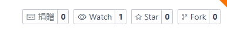

# Fork 與 Pull Request

## fork

fork 複製之後 你可以在自己的項目內去對文本編輯  
fork 之後的好處就是可以 去編輯

編輯之後 有什麼好處  
可以利用 Pull Request  
把編輯之後的內容發回去給原本的人

## Pull Request

對方可以看到你編輯的差異  
以及你的說明

然後可以決定是不是要合併你的更改

那這樣有什麼好處?

我們下載 txt 編輯之後 很容易就產生各種不同版本  
有時候可能有潤色潤色過的版本 可是我們卻是下載了 沒潤色的版本  
然後又因為不知道哪裡有差別 或者 很難找出來差別

而用這個就可以很明確地保持最新版本  
也能很明確的看出來差異

也會有歷史紀錄可以看出來每次改了些什麼

