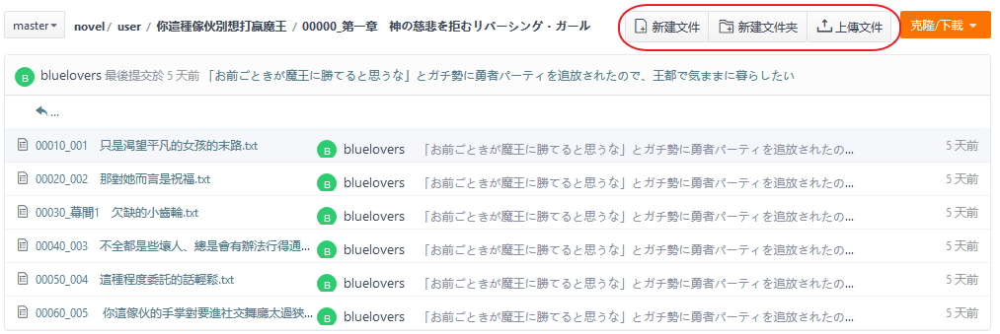

# 編輯瀏覽

## desc

### 可以直接在網頁上操作新增檔案或資料夾

> 如果是文字檔 建議使用 **新建文件** 這樣做的好處是可以避免文字檔編碼錯誤的問題

### 新增檔案時的介面

標記1 檔案名稱(記得加上附檔名 例如 .txt)  
標記2 檔案內容  
標記3 這次更新的註解(一行字)  
標記4 如果想要註解更多內容

### 點進去檔案之後 可以在網頁上直接編輯

### 可以查看編輯紀錄以及編輯差異

