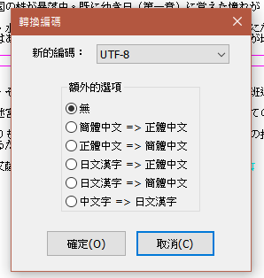

# MadEdit

    MadEdit 是個精巧的文字編輯器，具備了許多功能，像是語法顏色顯示、支援多種編碼（Big5,GBK,UTF-8/16/32）並可隨時改變編碼、十六進位/區塊模式、正規表示式搜尋與取代功能，MadEdit 目前在 Linux 與 Windows 平台上都可執行，也有中文語系檔，對中文支援良好，介面簡單清爽，開啟程式快速，是居家必備的文字編輯器。

## 下載點

如果只是想開檔案 轉編碼的 用原版就夠了  
雖然有的人會用 ConvertZ 轉碼  
但單純就轉編碼這件事情而言 MadEdit 轉出來的檔案相容性比較好

- [MadEdit](https://sourceforge.net/projects/madedit/) - 原版 已經沒有再更新 但轉碼功能正常
- [madedit-mod](https://github.com/LiMinggang/madedit-mod) - 改良版 (這三個版本裡面唯一一個有再放出新版的)
- [wxMEdit](https://github.com/wxMEdit/wxMEdit) - 同上 另一個改良版 (雖然原始碼有在更新 但 N 年 沒有放出編譯好新版檔案)
- 

## 使用方法簡易圖解

