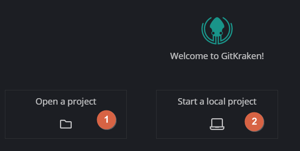

# gitkraken

> 一個還算挺酷的 git gui 軟體

官方網站 https://www.gitkraken.com/

## 安裝需求

安裝之前 請先安裝 [Git for Windows](../gitee/如何安裝git.md)

## 簡易教學

安裝完成後 會看到要求登入帳號

可以申請一個新的 gitkraken 帳號 或者 利用已經有的 github 帳號

### 調整程式設定

標記1 標記2 都能進入設定

---

從 標記1 的地方進入編輯器設定

標記2 為 分行風格 windows 為 `CRLF` 但是這裡推薦改為 `LF`

標記3 勾選之後 可以啟用自動斷行

### 開始一個 git

1. open a project 是去開啟現有電腦內已經有的 git repo
2. start a local project 則是去建立或者匯入 git repo

---

為開啟電腦內現有的

1. 瀏覽現有的 git repo 位置(點選之後就會詢問你資料夾位置在哪裡)
2. 最近開啟過的
3. 被標記為書籤的

---

#### 匯入碼雲上的 git repo

複製伺服器網址

將伺服器網址加上帳密 `帳號:密碼@` 用 `:` 區隔帳密 以及用 `@` 做結尾

> `https://gitee.com/bluelovers/novel.git`

改成

> https://帳號:密碼@gitee.com/bluelovers/novel.git

---

1. 點選 CLONE
2. 然後 將 加好帳密的網址 放到 標記4
3. 點選標記3 選擇資料夾存放位置
4. 最後點選 標記5 開始下載(會需要一段時間來下載完成)

### 開始使用(假設已經開啟一個 git repo)

#### 拉取更新 (Pull)

每次更改之前 或者 每次開啟 repo 的時候 推薦按一次 拉取更新

基本上 點 標記1 的地方就可以了  
也可以點 標記3 或者 標記2

---

#### 推送本地變更到遠端 (Push)

用來將本地變更的內容推到伺服器上  
(推送之前也可以點一次 PULL 來更新一下)

---

#### 瀏覽內容

這個軟體預設上只會顯示目前紀錄所在的版本的變更內容

標記1 可以用來切換 列表顯示或者樹狀顯示

標記2 則是可以查看目前紀錄所在的版本下的所有檔案

#### 增加檔案到記錄內

當 repo 底下有不屬於記錄內的檔案 或者 檔案有變更時

在所有紀錄的最上方 (標記1) 會多出一個 未儲存的改動紀錄  
訊息內容等同於 標記2 裡面輸入的內容

- 基本上就是輸入這一次改動內容是什麼之類的訊息
- 會將第一行作為這一次紀錄的標題訊息
- 允許輸入多行
- `#` 開頭的行 都會被無視並且忽略

標記3 為 未加入本次紀錄的檔案列表  
標記4 為 已加入本次紀錄的檔案列表

標記5 為 儲存本次紀錄(請注意所有變更只有按下 `push` 之後 才會上傳到伺服器上)

---

可以按 `stage file` 將檔案加入 或者 右鍵之後 按 `stage`

show in folder 可以開啟檔案所在的資料夾

## link

- [\[Git\]GitKraken 強大的剛剛好的Git GUI神器(1)基本篇](https://wellwind.idv.tw/blog/2018/04/03/git-using-gitkraken-1-basic/)
