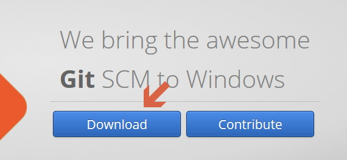
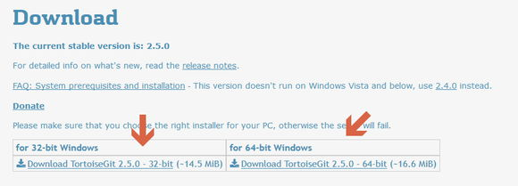
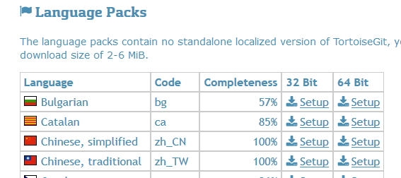

# 如何安裝 Git

## desc

順便說一下 如何安裝 git  
一開始用可能不習慣 但是以後 就會發現挺好用

首先先安裝 Git for Windows  
[http://gitforwindows.org/](http://gitforwindows.org/)

然後在安裝 TortoiseGit  
https://tortoisegit.org/download/

正常來說現在大多電腦都能安裝右邊的 x64 版本  
但是如果你無法安裝的話那就改裝 左邊的檔案

接著安裝語言包

然後底下有語言包  
zh cn 代表簡體

## 其他相關

* [Git - Git 安裝教學](https://git-scm.com/book/zh-tw/v2/%E9%96%8B%E5%A7%8B-Git-%E5%AE%89%E8%A3%9D%E6%95%99%E5%AD%B8)
* [安裝Git【教學1 開始使用Git】 | 連猴子都能懂的Git入門指南](https://backlog.com/git-tutorial/tw/intro/intro2_1.html)
* [Git 介紹與在Windows系統下安裝](https://progressbar.tw/posts/1)
* 
